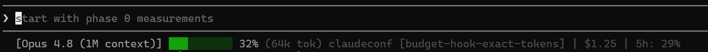

# claudeconf

## The problem

A long Claude Code session gets slow, expensive, and forgetful. The context
window fills with rule text you rarely need, stale docs, and re-derived state;
once it's full the agent compacts to ~12% of the window — and the reasoning
that lived only in the conversation doesn't come back. You pay for every token
of that bloat on every turn.

## What this is

A **copy-in catalog** of the Claude Code config that keeps a session's context
window lean: a progressive-disclosure `CLAUDE.md`, path-gated rules, compaction
continuity hooks, an anti-bloat write gate, a budget governor, and a statusline
that shows the burn. Each piece is a working example you copy into your own
`~/.claude/` by hand and adapt — **not** an installer. The only script activates
this repo's own git secret gate.

This is written for someone **already running Claude Code who doubts the
hook/rule/budget sprawl earns its keep.** The honest question — "does this
scaffolding cost me less than it saves?" — is what the rest of this page tries
to answer, including where the answer is "no."

## Does this actually work?

Scoped honestly: the evidence below shows **cost reduction for an existing
Claude Code user**, not proof that coding agents pay off in general (that needs
a with-vs-without-agent experiment this repo doesn't run).

**The statusline shows the real number you're spending.** It sums the exact
`input_tokens + cache_creation_input_tokens + cache_read_input_tokens` the API
reports for the turn — the same number the budget governor stops on:



**Progressive disclosure keeps ~8k tokens out of every turn.** The 4 path-gated
rules (~18 KB) and 6 L3 references (~16 KB) total ~35 KB — **~8k tokens** by a
rough 4-byte-per-token estimate. A flat `CLAUDE.md` that inlined all of them
would carry that on *every* turn; here they cost 10 deferred-load pointer lines
(6 references + 4 rules) in a 4.4 KB `CLAUDE.md`, and a rule body loads only when
you touch a file its glob matches.

- **The dollars are modest; the window is the point.** Cached, those tokens bill
  as `cache_read` (~$1.50/M on Opus), not full input (~$15/M) — ~$0.01/turn, ~$1
  over 100 turns. The real win is the window filling slower, so compaction (which
  keeps ~12% and doesn't restore conversation-only reasoning) comes later.
- **n=1 — a sense of scale, not a result.** The ~8k is a byte estimate, and the
  flat-`CLAUDE.md` baseline is a worst case: most non-adopters run a short
  `CLAUDE.md` with no rules, not an inlined 35 KB one.

**13 passing tests pin the budget governor's *measurement*** (run `pytest` from
the repo root) — the exact 130k count, the compaction regression, fail-open.
They prove the mechanism is correct; they do **not** prove the hook improves
your outcomes.

**One non-self-referential check:** this README and `ADOPT.md` pass the repo's
own `docs-bloat-gate.py` (density ≥ 0.45, no slop phrases). The anti-bloat rule
the repo preaches, the repo's own docs obey.

## What it costs you

A skeptic should weigh the tax, not just the upside:

- **5 hooks fire on lifecycle events** — every compaction, session start, and (for
  two of them) Bash/Write/Edit call runs a Python script. They fail open, but
  they're still latency on the hot path.
- **The bloat gate *refuses* writes.** Two of its three signals (slop phrase,
  low density) are unbypassable — it will block a `.md` write you wanted.
- **The budget governor interrupts.** At 130k tokens it injects a wrap-up
  reminder mid-run, whether or not you were ready to stop.
- **Setup is hand-work.** You merge a `settings.json` hooks block yourself,
  install `gitleaks` for the secret gate, and maintain the pytest suite. There
  is no auto-merge, by design (it's the most likely thing to break your config).

## When this isn't worth it

- The bloat gate **false-positives** on legitimately dense writing — a genuinely
  information-rich doc can trip the density floor.
- Some tasks **legitimately need >130k tokens**; the governor's wrap-up nudge
  fights you there. Raise the threshold or skip the hook.
- **None of this helps if you weren't going to run a long agent session
  anyway.** The whole catalog presupposes sessions long enough for context to
  become the bottleneck.

## Glossary

- **Compaction** — when Claude Code summarizes a full context window to free
  space; load-bearing reasoning can be lost in the summary.
- **Progressive disclosure** — keeping detail out of the always-loaded prompt
  and loading it only when triggered, so unused content costs nothing.
- **Path-gated** — a rule that auto-loads only when you read/edit a file
  matching its frontmatter `globs`.
- **Context cliff** — the point where the window is nearly full and the next
  action forces a compaction.
- **Fan-out** — splitting work across parallel subagents, each with its own
  context window.

## The catalog

Every piece, what it's for, and how to check it's working. Terse by design;
deeper prose for the two mechanisms that don't fit a cell is below the table.

| Piece | Purpose | How it works | How to use & verify | Cost | Evidence |
|---|---|---|---|---|---|
| `.claude/CLAUDE.md` | Keep rules out of the always-loaded prompt | "References" + "Rules Index" sections *point* at content instead of inlining it | Copy the structure; confirm rule bodies aren't pasted into it | Must keep the index in sync as rules change | ~8k tokens kept off every turn (above) |
| Path-gated rules (×4) | Topic rules that load only when relevant | Frontmatter `globs`; harness loads the body on a matching read/edit | `cp .claude/rules/*.md ~/.claude/rules/`; edit a matching file, watch the rule load | Loads on every matching file touch | `reading-large-files`, `testing`, `instruction-file-discipline`, `claude-md-edits` |
| L3 references (×6) | Long checklists/postmortems, on demand | Plain `.md`; loaded only when a `CLAUDE.md` pointer fires | Copy; reference from a pointer line | None until triggered | ~16 KB that never sits in context unbidden |
| `pre-compact.py` | Insurance copy before a compaction | `PreCompact` hook snapshots transcript + plan/todo to a sidecar | Wired via `settings.json`; check `snapshots/` after a compact | Runs on every compaction | — |
| `post-compact-restore.py` | Re-orient cheaply after compaction | `SessionStart` prints the newest snapshot's recovery pointer | Resume a session; read the printed pointer | Runs on compact/resume | — |
| `session-start-health.py` | Catch oversized memory early | `SessionStart` warns when a `MEMORY.md` > 180 lines; GCs stale sentinels | Startup; warning prints if memory is too big | Runs on every startup | Claude Code silently drops memory past ~200 lines |
| `docs-bloat-gate.py` | Block bloated `.md` from entering context | `PreToolUse` on Write/Edit/Bash; 3 signals (slop / density / size) | Try-in-isolation snippet in hooks README; exit 2 = blocked | Refuses writes; 2 signals unbypassable | This README passes it |
| `impag-budget-check.py` | Stop a long run before the context cliff | `PostToolUse` on Bash; exact token read, hard-stop at 130k | Wired via `settings.json`; fires at a `git commit` past 130k | Interrupts mid-run at the threshold | 13 passing tests |
| `statusline.sh` | Show live context %, cost, distance-to-stop | Reads Claude Code's statusline JSON; needs `jq` + `git` | `cp` + point `statusLine` at it | Negligible | Screenshot above |
| `settings.json` | Wire the 5 hooks | Matcher → script entries | **Merge**, don't overwrite, into yours | One-time hand-merge | — |
| Skills (×5) | Context-hygiene, fan-out, and AI-text exemplars | `condense`, `de-bloat`, `claude-md-progressive-disclosurer`, `impag`, `detect-ai-text-humanize` | `cp -r .claude/skills/* ~/.claude/skills/`; invoke `/<name>` | Skill body loads when matched | Self-contained |
| Secret gate | No secret/PII ships | git hooks + blocking PII check + CI (below) | `./install.sh`; try a commit with a fake home path | Blocks commits/pushes that leak | Blocking by design |
| `.claudeignore` | Keep archived plans out of context | Lists paths the harness skips | Add closed plans to it | None | — |

## The budget governor (detail)

`impag-budget-check.py` is a `PostToolUse` hook on `Bash` that makes a long
`/impag` run stop taking new work before the session hits its context cliff. It
reads the **exact, compaction-aware** token count from the transcript tail
(no estimate, no dependency) and hard-stops at 130k: silent below, a wrap-up
reminder at or above. It fails open — any error exits 0 and never blocks a
commit. Why it and `statusline.sh` are pinned to the *same* 130k mark and
measurement is explained in
**[`.claude/hooks/README.md`](.claude/hooks/README.md)**.

## The secret gate

A three-layer check that no credential or personal identity ships — this is the
one thing in the repo with a real install step (`./install.sh`):

| Layer | What runs | When |
|---|---|---|
| `hooks/pre-commit` | gitleaks (staged) **+** blocking identity/PII check | every commit |
| `hooks/pre-push` | full working-tree gitleaks scan | every push |
| `.github/workflows/gitleaks.yml` | gitleaks on push + PR | server-side (un-bypassable) |

The PII check (`scripts/check-hardcoded-paths.sh`) is **blocking** here (it is
advisory in the source dotfiles): a public teaching repo has no legitimate
reason to ship a home path or an email. It matches **generic** patterns
(`/home/<user>/`, any email), never a hardcoded identity — baking in a real one
would re-leak the PII being scrubbed.

`./install.sh` sets `core.hooksPath` to the repo's `hooks/`, so those scripts
run on every commit and push in this clone. Review `hooks/` and `scripts/`
before running it — treat them like any code you execute.

## Two `hooks/` directories — don't conflate them

| Directory | What it is | Goes where |
|---|---|---|
| **`.claude/hooks/`** | Claude Code **runtime** hooks (context continuity, anti-bloat, budget governor) | your `~/.claude/hooks/` |
| **`hooks/`** (repo root) | **git** hooks (the secret gate) | activated in *this* clone via `./install.sh` |

## Quick start

```sh
git clone https://github.com/KristjanHS/claudeconf
cd claudeconf
./install.sh            # optional: activate the git secret gate for this clone
```

Then see **[ADOPT.md](ADOPT.md)** for how to copy each piece into your own
`~/.claude/`.
